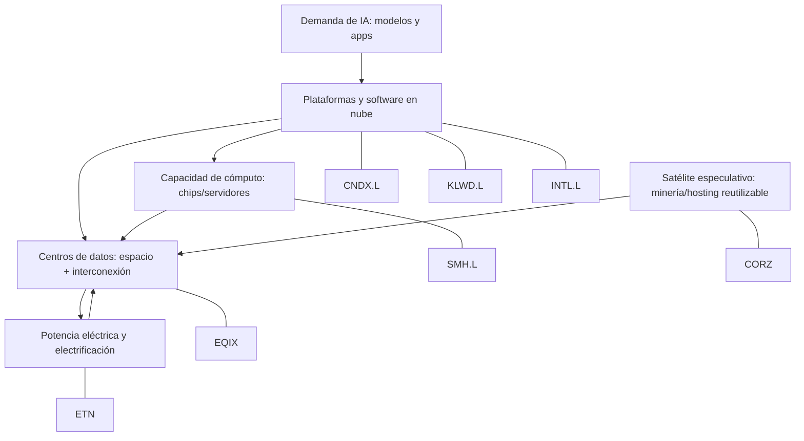

# Mapa de Cadena de Suministro — Diagrama

---

## Diagrama Mermaid

---

## Lectura del diagrama

### Flujo de arriba a abajo (demand → supply)

1. **Demanda de IA** (modelos, apps, usuarios) genera necesidad de...
2. **Plataformas y software en nube** (hiperscalers, SaaS) que requieren...
3. **Capacidad de cómputo** (chips, GPUs, servidores) que se alojan en...
4. **Centros de datos** (espacio físico, interconexión) que necesitan...
5. **Potencia eléctrica** (distribución, transformadores, cargas críticas)

### Satélite lateral

6. **Minería/hosting reutilizable** (CORZ) — activos con MW conectados que pueden reconvertirse para servir al nodo de centros de datos

### Mapping ETF → Nodo

| Nodo | ETFs/Acciones |
|------|--------------|
| Plataformas/Software | CNDX.L, KLWD.L, INTL.L |
| Cómputo/Chips | SMH.L |
| Centros de datos | EQIX |
| Electrificación | ETN |
| Especulativo | CORZ |

---

## Insight del diagrama

La tesis de SA LP se posiciona en los **nodos inferiores** del diagrama (potencia, centros de datos, hosting reutilizable) — exactamente donde están los cuellos de botella físicos. La cartera modelo propuesta cubre **todos los nodos** para diversificar el riesgo de que la tesis se materialice en un nodo distinto al esperado.
